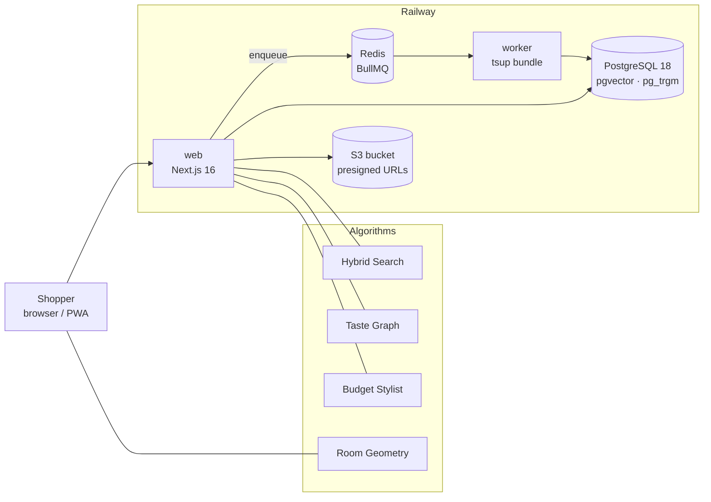

<div align="center">

# 🪟 Vitrine

### An AI-native e-shop you can browse, type to, talk to, or show a photo.

*βιτρίνα (vi-TREE-na): Greek for "shop window"*

<br>


**ITC 4949 Capstone Project** · George Papasotiriou · [g.papasotiriou@acg.edu](mailto:g.papasotiriou@acg.edu)

</div>

---

## ✨ What is Vitrine?

Most online shops feel like spreadsheets: endless grids of identical cards.
**Vitrine is designed to feel like a shop window at dusk.** The interface stays quiet, products
stand on plinths, and light is used to show where the AI is acting.

Underneath is a real commerce engine and **four algorithms I built from scratch**. Each has its own
maths, its own tests and its own evaluation:

<table>
<tr>
<td width="50%" valign="top">

### 🔎 Hybrid Search
Search that understands `μαύρη δερμάτινη πολυθρόνα κάτω από 300€`
(black leather armchair under €300), typos like `chiar`, and **Greeklish** such as `kanapes`.

Parse → lexical + fuzzy retrieval → **Reciprocal Rank Fusion** → Bayesian re-ranking →
**Maximal Marginal Relevance** diversity.

</td>
<td width="50%" valign="top">

### 🕸️ Taste Graph
A recommender that learns from behaviour **only with consent**.

Session co-occurrence edges with time decay, content vectors, **Personalized PageRank**
(random walk with restart), and a *This-or-That* game that learns a new shopper's taste from a
few choices.

</td>
</tr>
<tr>
<td width="50%" valign="top">

### 💶 Budget Stylist
*"A reading corner for €1,500, nothing orange."*

A constrained optimiser that picks the best set of products under a budget. It scores how well
pieces go together using style similarity and **colour harmony in CIELAB/LCh**, and on test cases it
matches exhaustive search with **zero optimality gap**.

</td>
<td width="50%" valign="top">

### 📐 See It In Your Room
Place a sofa in a photo of your room **at true scale**, with no AR headset and no LiDAR.

Put an A4 sheet on the floor and tap its corners. Vitrine then refines them to sub-pixel accuracy,
fits a **homography (DLT)**, recovers the camera pose, reads the focal length from EXIF, and
projects the product onto your floor.

</td>
</tr>
</table>

---

## 🛍️ Features

| | |
|---|---|
| 🌍 **Truly bilingual** | English and Greek as equal storefronts, with hand-written Greek, `hreflang` and localised URLs |
| 🧾 **EU VAT done right** | Prices shown for your country; VAT charged by the **delivery address**, following EU One-Stop Shop rules |
| 🔒 **Privacy by design** | Your IP is looked up in a **local** country database and never sent to third parties. Personalisation is opt-in, with *Forget my history* |
| 🛒 **Real commerce core** | Cart, stock holds, idempotent guest checkout and a tested **order state machine** |
| 💰 **Money is never a float** | Integer cents everywhere. Totals are always recomputed on the server |
| 🤖 **Safe agent-driven UI** | The AI Concierge sends only **validated, allow-listed commands**, never code. Every action is shown, announced and undoable |
| ♿ **Accessible** | WCAG 2.2 AA, full keyboard support, screen-reader announcements, `prefers-reduced-motion` |
| 📱 **Installable PWA** | Hand-written service worker with a network-first strategy, so prices are never served stale |

---

## 🏗️ Architecture



- **One database as the source of truth:** relational data, full-text, fuzzy and vector search all
  live in PostgreSQL, so a hybrid search is a single round trip.
- **Web and worker from one repository:** the worker is bundled into a single file, so there are no
  module-resolution surprises at runtime.
- **Room geometry runs in the browser:** your room photo doesn't need to leave your device.

---

## 🧰 Tech Stack

| Layer | Technology |
|---|---|
| **Frontend** | Next.js 16 (App Router, Turbopack), React 19.2, Tailwind CSS v4, Radix UI, Motion, next-intl |
| **Backend** | Route handlers, Zod validation at every boundary, Pino structured logging |
| **Data** | PostgreSQL 18, pgvector, pg_trgm, unaccent, Drizzle ORM |
| **Jobs** | Redis + BullMQ, worker bundled with tsup |
| **Storage** | S3-compatible bucket with presigned URLs |
| **Quality** | Vitest, Playwright + axe-core, Lighthouse, ESLint, TypeScript strict |
| **Hosting** | Railway |

---

## 🚀 Getting Started

**Requirements:** Node.js 24+ and pnpm. No Docker needed.

```bash
git clone https://github.com/<your-username>/vitrine.git
```

```bash
cd vitrine && pnpm install
```

```bash
pnpm local
```

That's it. `pnpm local` starts an embedded PostgreSQL with pgvector, seeds a sample catalogue, and
opens the shop at **http://localhost:3000**.

### Useful commands

| Command | What it does |
|---|---|
| `pnpm local` | Database + dev server |
| `pnpm build` | Production build (web + worker) |
| `pnpm test` | Unit tests |
| `pnpm test:integration` | Integration tests against a real PostgreSQL |
| `pnpm test:e2e` | Playwright end-to-end tests (desktop + mobile) |
| `pnpm evals:stylist` | Budget Stylist evaluation |
| `pnpm evals:room` | Room geometry evaluation |
| `pnpm reco simulate` | Generate synthetic shopper sessions for the Taste Graph |

---

## ☁️ Deploying to Railway

Vitrine runs as **two services from this one repository**:

| Service | Build | Start |
|---|---|---|
| `web` | `pnpm build` | `pnpm start` (`pnpm db:setup` runs pre-deploy) |
| `worker` | `pnpm build` | `pnpm worker:start` |

Add the **PostgreSQL (pgvector)** and **Redis** services, then set the variables listed in
[`.env.example`](.env.example). The health check is at `/api/health`.

---

## 🧪 Testing

```
✔ 549 unit tests         pure logic and all four algorithms
✔  96 integration tests  real PostgreSQL with pgvector
✔ 218 end-to-end tests   desktop + mobile, including accessibility checks
```

The algorithms are also measured, not just tested. The Budget Stylist is checked against
exhaustive search and a greedy baseline, and the room geometry against synthetic cameras with known
answers.

---

## 📁 Project Structure

```
src/
├── app/            routes: storefront pages and API
├── components/     commerce, concierge, room, shell, ui
├── lib/
│   ├── search/     🔎 hybrid search
│   ├── reco/       🕸️ Taste Graph
│   ├── optimize/   💶 Budget Stylist
│   ├── vision/     📐 room geometry
│   ├── commerce/   cart, pricing, VAT, order state machine
│   ├── catalog/    catalogue import and queries
│   └── db/         schema and client
└── worker/         background jobs
scripts/            local stack, imports, evaluations
tests/              integration and end-to-end suites
drizzle/            database migrations
```

---

## 🗺️ Roadmap

- [x] Design system and bilingual storefront
- [x] Catalogue import and hybrid search
- [x] Taste Graph recommendations
- [x] Budget Stylist
- [x] Room placement (paper method)
- [x] Cart, checkout and EU VAT
- [ ] AI Concierge (chat and voice)
- [ ] Accounts (passkeys, 2FA)
- [ ] Stripe payments
- [ ] Virtual try-on
- [ ] Paper-free room placement (depth estimation)

---

## 🙏 Credits

- Product photography and metadata: [Amazon Berkeley Objects](https://amazon-berkeley-objects.s3.amazonaws.com/index.html), **CC BY-NC 4.0**
- IP-to-country data: [DB-IP](https://db-ip.com), **CC BY 4.0**

> ⚠️ **Vitrine is an academic project, not a real shop.** Prices are synthetic, and no real orders
> or payments are processed.

---

<div align="center">

**© 2026 George Papasotiriou. All rights reserved.**

ITC 4879 Capstone Project

</div>
