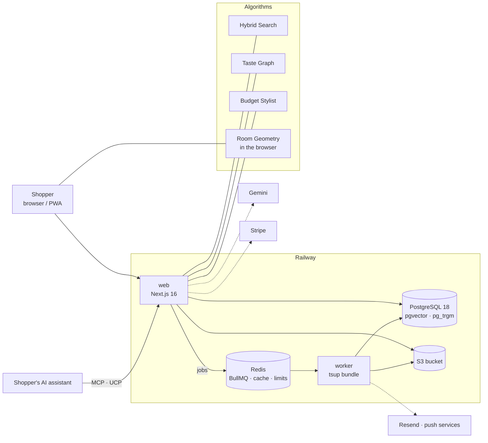

<div align="center">

# 🪟 Vitrine

### An AI-native e-shop you can browse, type to, talk to, show a photo — or hand to your own AI assistant.

*βιτρίνα (vi-TREE-na): Greek for "shop window"*

<br>


**ITC 4949 Capstone Project** · George Papasotiriou · [g.papasotiriou@acg.edu](mailto:g.papasotiriou@acg.edu)

**[Live demo](https://itc-4879-capstone-vitrine-production.up.railway.app)** · payments in test mode, nothing is shipped

</div>

---

## ✨ What is Vitrine?

Most online shops feel like spreadsheets: endless grids of identical cards.
**Vitrine is designed to feel like a shop window at dusk.** The interface stays quiet, products
stand on plinths at their true size, and light shows where the AI is acting.

You can shop the ordinary way, or:

- **type or talk** to the Concierge (*Σύμβουλος*), which searches, compares, fills your cart and drives the page while you watch;
- **show a photo**, and find pieces in the colours you like, or see a garment on you;
- **place a sofa in a photo of your room** at its real size, in your room's own light;
- **let your own AI assistant shop for you** over MCP, with a key you control.

Underneath is a real commerce engine (cart, EU VAT, Stripe, orders, returns, a support desk) and
**four algorithms built from scratch**, each with its own maths, tests and measured evaluation.

---

## 🧠 The four algorithms

<table>
<tr>
<td width="50%" valign="top">

### 🔎 Hybrid Search
Understands `μαύρη δερμάτινη πολυθρόνα κάτω από 300€` (black leather armchair under €300),
typos like `chiar`, and **Greeklish** such as `kanapes`.

Parse → lexical + fuzzy retrieval → **Reciprocal Rank Fusion** → Bayesian re-ranking →
**Maximal Marginal Relevance**.

📊 NDCG@10 **0.543** on 500 Amazon ESCI queries (lexical alone: 0.455).

</td>
<td width="50%" valign="top">

### 🕸️ Taste Graph
A recommender that learns from behaviour **only with consent**.

Session co-occurrence edges with time decay, content vectors, **Personalized PageRank**
(random walk with restart) and a *This-or-That* game that learns a new shopper's taste from a
few choices. Powers "Complete the set" and the shelves.

</td>
</tr>
<tr>
<td width="50%" valign="top">

### 💶 Budget Stylist
*"A reading corner for €1,500, nothing orange."*

A constrained optimiser that picks the best set of pieces under a budget, scoring how well they go
together with style similarity and **colour harmony in CIELAB/LCh**.

📊 **Zero optimality gap** against exhaustive search on 197 instances, 14% better than greedy,
4 ms at the 95th percentile.

</td>
<td width="50%" valign="top">

### 📐 See It In Your Room
A sofa in a photo of your room **at true scale**, with no LiDAR.

- **With a sheet of A4:** sub-pixel corners, a **homography (DLT)**, camera pose, focal length from EXIF.
- **Without paper:** **Depth Anything V2** runs *in your browser* (ONNX Runtime Web), and a **RANSAC** floor with a gravity prior sets the scale.
- **In your light:** a white-patch estimate relights the product photo in linear light and casts its shadow.

📊 0.3% size error on exact depth · 6.9% on published room photos · light matching cuts the colour
difference to the truth from **8.2 to 4.7 ΔE2000** on held-out rooms.

</td>
</tr>
</table>

Smaller home-made pieces: aspect-based **review summaries** in English and Greek (negation,
intensifiers, every point linked to the sentences behind it), a **k-means colour reader** for
search by photo, and **CIEDE2000** implemented from the paper.

---

## 🛍️ Features

| | |
|---|---|
| 🌍 **Truly bilingual** | English and Greek as equal storefronts: hand-written Greek, `hreflang`, localised URLs |
| 🤖 **AI Concierge** | Chat or voice, 28 typed tools, approval cards for anything that matters, undo for every action, a cost guard with per-user credits, a daily budget and a kill switch |
| 🎙️ **Voice** | Speak in Chrome or Edge with no key; live voice with OpenAI or Google realtime models when configured; captions always on |
| 🪑 **3,192 products** | Real 3D scans and 360° spins from Amazon Berkeley Objects, AR through WebXR, Scene Viewer and Quick Look |
| 📷 **Search by photo & try-on** | Colours read from your photo; virtual try-on with consent. Photos expire after 24 hours and can be deleted at once |
| 🪟 **Showcase mode** | Full-screen shop windows composed by the Budget Stylist, pieces at true relative size |
| 🔌 **Agent-ready** | An **MCP** server (spec 2026-07-28, plus older `initialize` clients), personal agent keys, **UCP** checkout sessions that always hand the buyer back to the shop, **WebMCP** tools for assistants built into the browser |
| 🧾 **EU VAT done right** | Prices for your country; VAT by the **delivery address** (One-Stop Shop), delivery to 10 countries beyond the EU |
| 💳 **Payments** | Stripe in test mode: Payment Element, Apple Pay and Google Pay, signed idempotent webhooks, refunds. Without keys, a local test payment |
| 👤 **Accounts** | Email and password, passkeys, TOTP two-step codes, four roles; guest carts merged on sign-in |
| 🔔 **Notifications** | Web Push written from RFC 8291/8292 with no dependency: order updates, watched prices, desk replies — opt-in only |
| 🛠️ **Running the shop** | Order desk, product editor with AI copy drafts, review moderation, support desk with a reply clock, dashboards, an audit log, a weekly PDF report |
| 🔒 **Privacy by design** | IP looked up in a **local** country database; personalisation opt-in; every stored line about you listed at `/account/data`, deletable and downloadable |
| 🛡️ **Security** | Nonce-based Content Security Policy on every page, HSTS, Permissions-Policy, shared rate limits in Redis; the model never owns money or truth |
| ♿ **Accessible** | WCAG 2.2 AA, full keyboard support, a reading-comfort panel (text size, contrast, readable font, motion), `prefers-reduced-motion` |
| 📱 **Installable PWA** | Hand-written service worker; network-first, so prices are never stale |

---

## 🏗️ Architecture


```mermaid
flowchart LR
    U[Shopper<br/>browser / PWA] --> W
    AG[Shopper's AI assistant] -->|MCP · UCP| W

    subgraph Railway
        W[web<br/>Next.js 16] -->|jobs| R[(Redis<br/>BullMQ · cache · limits)]
        R --> K[worker<br/>tsup bundle]
        W --> P[(PostgreSQL 18<br/>pgvector · pg_trgm)]
        K --> P
        W --> S[(S3 bucket)]
        K --> S
    end

    W -.-> G[Gemini]
    W -.-> ST[Stripe]
    K -.-> E[Resend · push services]

    subgraph Algorithms
        A1[Hybrid Search]
        A2[Taste Graph]
        A3[Budget Stylist]
        A4[Room Geometry<br/>in the browser]
    end

    W --- A1 & A2 & A3
    U --- A4
```

- **One tool registry.** Every AI capability is one typed tool. Chat, voice, MCP, WebMCP and UCP are thin adapters over it, with the same authorisation.
- **One database as the source of truth.** Relational data, full-text, fuzzy and vector search all live in PostgreSQL; prices and totals always come from it, never from a model.
- **Web and worker from one repository.** The worker is bundled into a single file, so there are no module-resolution surprises at runtime.
- **Your room photo stays on your device.** Room geometry and depth estimation run in the browser.

---

## 🧰 Tech Stack

| Layer | Technology |
|---|---|
| **Frontend** | Next.js 16 (App Router, Turbopack), React 19.2, Tailwind CSS v4, Radix UI, Motion, next-intl |
| **3D / vision** | model-viewer, three.js, ONNX Runtime Web (Depth Anything V2) |
| **Backend** | Route handlers, Zod at every boundary, Pino structured logs |
| **Data** | PostgreSQL 18, pgvector, pg_trgm, unaccent, Drizzle ORM |
| **Jobs & cache** | Redis + BullMQ, worker bundled with tsup |
| **AI** | AI SDK 7 with Gemini; OpenAI or Google realtime for live voice; FASHN for try-on |
| **Auth & payments** | Better Auth (passkeys, TOTP), Stripe (test mode) |
| **Email & push** | Resend, Web Push (RFC 8291/8292) |
| **Quality** | Vitest, Playwright + axe-core, Lighthouse, k6, ESLint, TypeScript strict |
| **Hosting** | Railway |

---

## 🚀 Getting Started

**Requirements:** Node.js 24 and pnpm. No Docker, no API keys.

```bash
git clone https://github.com/<your-username>/vitrine.git
```

```bash
cd vitrine && pnpm install
```

```bash
pnpm local
```

`pnpm local` starts an embedded PostgreSQL with pgvector, seeds the full catalogue on first start,
and opens the shop at **http://localhost:3000**.

With no keys at all:

- the Concierge answers from rules (demo mode), with the same tools, approvals and undo;
- emails arrive at `/en/lab/outbox`;
- payment is a local test payment.

Each key in [`.env.example`](.env.example) switches on the real service.

### Useful commands

| Command | What it does |
|---|---|
| `pnpm local` | Database + dev server |
| `pnpm build` | Production build (web + worker) |
| `pnpm test` | Unit tests |
| `pnpm test:integration` | Integration tests against a real PostgreSQL |
| `pnpm test:e2e` | Playwright end-to-end tests (desktop + mobile, accessibility, security policy) |
| `pnpm evals:full` | Concierge golden and adversarial tasks (needs a running shop) |
| `pnpm evals:esci` | Hybrid search on Amazon ESCI queries |
| `pnpm evals:stylist` | Budget Stylist against exhaustive search |
| `pnpm evals:room` · `evals:room-rendered` · `evals:room-harmonize` | Room geometry, depth and light matching |
| `pnpm reco simulate` | Synthetic shopper sessions for the Taste Graph |
| `pnpm push keys` | Make the VAPID key pair for notifications |
| `pnpm demo:reset` | A fresh local shop (the old database is set aside, never deleted) |

---

## 🔌 Connect your own AI assistant

Any MCP client can search the shop, with no key needed:

```json
{
  "mcpServers": {
    "vitrine": { "type": "http", "url": "https://<your-app>/api/mcp" }
  }
}
```

To let the assistant use **your** cart and orders, make a key at `/account/agents`, choose what it
may do and for how long, and add `"headers": { "Authorization": "Bearer vta_…" }`. Keys are stored
only as a fingerprint and can be revoked at any time.

Checkout always ends on the shop's own page, where you pay yourself. Shopping agents can discover
the shop at `/.well-known/ucp`.

---

## ☁️ Deploying to Railway

Vitrine runs as **two services from this one repository**, plus PostgreSQL (pgvector template),
Redis and a Bucket:

| Service | Build | Start |
|---|---|---|
| `web` | `pnpm build` | `pnpm start:app`, with `pnpm db:setup` as the pre-deploy command |
| `worker` | `pnpm build` | `pnpm worker:start` |

`pnpm db:setup` applies the migrations and syncs the catalogue on every deploy. The health check
is `/api/health`.

**Required:** `APP_URL`, `DATABASE_URL`, `REDIS_URL`, `COOKIE_SECRET`, `BETTER_AUTH_SECRET` and
the bucket's S3 variables.

**Optional:** each turns on one feature when set, and the shop works without it.

| Variables | Feature |
|---|---|
| `AI_PROVIDER`, `GOOGLE_GENERATIVE_AI_API_KEY` | Gemini |
| `VOICE_PROVIDER`, `OPENAI_API_KEY` | Live voice |
| `STRIPE_*` | Stripe payments (test keys only) |
| `RESEND_API_KEY`, `EMAIL_FROM` | Email |
| `VAPID_*` | Push notifications |
| `FASHN_API_KEY` | Virtual try-on |
| `GOOGLE_CLIENT_*` | Google sign-in |

The full list is in [`.env.example`](.env.example).

---

## 🧪 Testing

```
✔ 1,207 unit tests         pure logic, all four algorithms, protocols, crypto
✔   231 integration tests  real PostgreSQL with pgvector
✔   440 end-to-end tests   desktop + mobile, accessibility checks, security policy enforced
✔  38/38 Concierge tasks   plus 15/15 adversarial (prompt injection, other people's data, paying without asking)
```

The algorithms are measured, not just tested:

- the search on public relevance judgements;
- the Stylist against exhaustive search;
- the room geometry on synthetic cameras, published room photos and rendered rooms with exact answers;
- light matching on rooms it was never tuned on;
- Web Push byte for byte against the RFC's worked example.

---

## 📁 Project Structure

```
src/
├── app/              pages (storefront, account, staff, admin) and API routes
├── components/       commerce, concierge, room, display, staff, ui
├── lib/
│   ├── search/       🔎 hybrid search
│   ├── reco/         🕸️ Taste Graph
│   ├── optimize/     💶 Budget Stylist
│   ├── vision/       📐 room geometry, depth, light matching, colour
│   ├── ai/           tool registry, prompts, providers, MCP / WebMCP / UCP adapters
│   ├── commerce/     cart, pricing, VAT, order state machine
│   ├── payments/     Stripe
│   ├── push/         Web Push (RFC 8291/8292)
│   ├── security/     security headers and CSP
│   ├── kv/           Redis: limits, cache, trending, live updates
│   └── db/           schema and client
└── worker/           background jobs
scripts/              local stack, imports, evaluations
evals/                Concierge golden and adversarial tasks
tests/                integration and end-to-end suites
drizzle/              database migrations
```

---

## 🗺️ Roadmap

- [x] Design system and bilingual storefront
- [x] Catalogue with 3D scans, hybrid search, Taste Graph, Budget Stylist
- [x] Cart, checkout, EU VAT and exports, orders and returns
- [x] Room placement, with paper and without, plus light matching
- [x] Accounts (passkeys, two-step codes, roles)
- [x] AI Concierge (chat and voice), search by photo, virtual try-on
- [x] Staff desk, dashboards, support desk, weekly report
- [x] Stripe payments (test mode), Redis store, Showcase mode, review summaries
- [x] Agent-ready shop (MCP, WebMCP, UCP) and Web Push
- [x] Security hardening (nonce CSP, HSTS)
- [x] User study with real shoppers
- [x] Taste Graph evaluation on the OTTO dataset
- [x] Model bake-off for the Concierge

---

## 🙏 Credits

- Product data, photography and 3D models: [Amazon Berkeley Objects](https://amazon-berkeley-objects.s3.amazonaws.com/index.html) (Collins et al., CVPR 2022), **CC BY 4.0**
- Depth estimation: [Depth Anything V2 Metric (indoor, small)](https://huggingface.co/depth-anything/Depth-Anything-V2-Metric-Indoor-Small-hf), **Apache-2.0**
- IP-to-country data: [DB-IP](https://db-ip.com), **CC BY 4.0**
- Typeface: Commissioner by Kostas Bartsokas, **SIL Open Font License**

> ⚠️ **Vitrine is an academic project, not a real shop.** Prices and stock are synthetic; payments
> run in test mode and nothing is ever shipped.

---

<div align="center">

**© 2026 George Papasotiriou. All rights reserved.**

ITC 4949 Capstone Project

</div>
